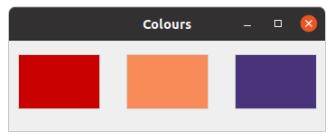
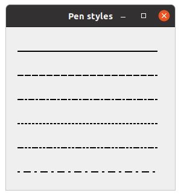
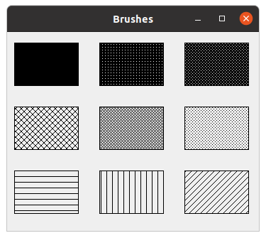

# PyQt5绘图

PyQt5绘画系统能够呈现矢量图形,图像,和大纲font-based文本。我们也可以在程序中调用系统api自定义绘图控件。

绘图要在paintEvent()方法中实现。在QPainter对象的begin()与end()方法间编写绘图代码。它会在控件或其他图形设备上进行低级的图形绘制。

> ## 绘制文本

我们先以窗体内Unicode文本的绘制为例。

```python
# -*- coding: utf-8 -*-

"""
PyQt5 tutorial 

In this example, we draw text in Russian azbuka.

author: py40.com
last edited: 2017年3月
"""
import sys
from PyQt5.QtWidgets import QWidget, QApplication
from PyQt5.QtGui import QPainter, QColor, QFont
from PyQt5.QtCore import Qt


class Example(QWidget):
    def __init__(self):
        super().__init__()

        self.initUI()

    def initUI(self):
        self.text = u'\u041b\u0435\u0432 \u041d\u0438\u043a\u043e\u043b\u0430\
\u0435\u0432\u0438\u0447 \u0422\u043e\u043b\u0441\u0442\u043e\u0439: \n\
\u0410\u043d\u043d\u0430 \u041a\u0430\u0440\u0435\u043d\u0438\u043d\u0430'

        self.setGeometry(300, 300, 280, 170)
        self.setWindowTitle('Draw text')
        self.show()

    def paintEvent(self, event):
        qp = QPainter()
        qp.begin(self)
        self.drawText(event, qp)
        qp.end()

    def drawText(self, event, qp):
        qp.setPen(QColor(168, 34, 3))
        qp.setFont(QFont('Decorative', 10))
        qp.drawText(event.rect(), Qt.AlignCenter, self.text)


if __name__ == '__main__':
    app = QApplication(sys.argv)
    ex = Example()
    sys.exit(app.exec_())
```

在我们的示例中,我们绘制一些Cylliric文本。文本垂直和水平对齐。

```python
def paintEvent(self, event):
...
```

绘制工作在paintEvent的方法内部完成。

```python
qp = QPainter()
qp.begin(self)
self.drawText(event, qp)
qp.end()
```

QPainter类负责所有的初级绘制。之间的所有绘画方法去start()和end()方法。实际的绘画被委托给drawText()方法。

```python
qp.setPen(QColor(168, 34, 3))
qp.setFont(QFont('Decorative', 10))
```

在这里,我们定义一个画笔和一个字体用于绘制文本。

```python
qp.drawText(event.rect(), Qt.AlignCenter, self.text)
```

drawText()方法将文本绘制在窗体，显示在中心

> ## 画点

点是可以绘制的最简单的图形对象。

```python
# -*- coding: utf-8 -*-

"""
PyQt5 tutorial

In the example, we draw randomly 1000 red points
on the window.

author: py40.com
last edited: 2017年3月
"""
import sys, random
from PyQt5.QtWidgets import QWidget, QApplication
from PyQt5.QtGui import QPainter, QColor, QPen
from PyQt5.QtCore import Qt


class Example(QWidget):
    def __init__(self):
        super().__init__()

        self.initUI()

    def initUI(self):
        self.setGeometry(300, 300, 280, 170)
        self.setWindowTitle('Points')
        self.show()

    def paintEvent(self, e):
        qp = QPainter()
        qp.begin(self)
        self.drawPoints(qp)
        qp.end()

    def drawPoints(self, qp):
        qp.setPen(Qt.red)
        size = self.size()

        for i in range(1000):
            x = random.randint(1, size.width() - 1)
            y = random.randint(1, size.height() - 1)
            qp.drawPoint(x, y)


if __name__ == '__main__':
    app = QApplication(sys.argv)
    ex = Example()
    sys.exit(app.exec_())
```

在这例子中，我们在窗口上随机绘制了1000个红点

```python
qp.setPen(Qt.red)
```

设置画笔为红色，我们使用了预定义的Qt.red常量

```python
size = self.size()
```

每次我们改变窗口的大小,生成一个 paint event 事件。我们得到的当前窗口的大小size。我们使用窗口的大小来分配点在窗口的客户区。

```python
qp.drawPoint(x, y)
```

通过drawpoint绘制圆点

> ## 颜色

颜色是一个对象代表红、绿、蓝(RGB)强度值。有效的RGB值的范围从0到255。我们可以用不同的方法定义了一个颜色。最常见的是RGB十进制或十六进制值的值。我们也可以使用一个RGBA值代表红色,绿色,蓝色,透明度。我们添加一些额外的信息透明度。透明度值255定义了完全不透明,0是完全透明的,例如颜色是无形的。

```python
# -*- coding: utf-8 -*-

"""
PyQt5 tutorial

This example draws three rectangles in three
#different colours.

author: py40.com
last edited: 2017年3月
"""
import sys
from PyQt5.QtWidgets import QWidget, QApplication
from PyQt5.QtGui import QPainter, QColor, QBrush


class Example(QWidget):
    def __init__(self):
        super().__init__()

        self.initUI()

    def initUI(self):
        self.setGeometry(300, 300, 350, 100)
        self.setWindowTitle('Colours')
        self.show()

    def paintEvent(self, e):
        qp = QPainter()
        qp.begin(self)
        self.drawRectangles(qp)
        qp.end()

    def drawRectangles(self, qp):
        col = QColor(0, 0, 0)
        col.setNamedColor('#d4d4d4')
        qp.setPen(col)

        qp.setBrush(QColor(200, 0, 0))
        qp.drawRect(10, 15, 90, 60)

        qp.setBrush(QColor(255, 80, 0, 160))
        qp.drawRect(130, 15, 90, 60)

        qp.setBrush(QColor(25, 0, 90, 200))
        qp.drawRect(250, 15, 90, 60)


if __name__ == '__main__':
    app = QApplication(sys.argv)
    ex = Example()
    sys.exit(app.exec_())
```

实例中我们绘制了3个不同颜色的矩形

```python
color = QColor(0, 0, 0)
color.setNamedColor('#d4d4d4')
```

在这里,我们定义一个使用十六进制符号颜色。

```python
qp.setBrush(QColor(200, 0, 0))
qp.drawRect(10, 15, 90, 60)
```

我们为QPainter设置了一个笔刷(Bursh)对象并用它绘制了一个矩形。笔刷是用于绘制形状背景的基本图形对象。drawRect()方法接受四个参数，前两个是起点的x,y坐标，后两个是矩形的宽和高。这个方法使用当前的画笔与笔刷对象进行绘制。



> ## QPen(画笔)

QPen是一个基本的图形对象。用于绘制线条、曲线和轮廓的矩形、椭圆、多边形或其他形状。

```python
# -*- coding: utf-8 -*-

"""
PyQt5 tutorial

In this example we draw 6 lines using
different pen styles.

author: py40.com
last edited: 2017年3月
"""
import sys
from PyQt5.QtWidgets import QWidget, QApplication
from PyQt5.QtGui import QPainter, QColor, QPen
from PyQt5.QtCore import Qt


class Example(QWidget):
    def __init__(self):
        super().__init__()

        self.initUI()

    def initUI(self):
        self.setGeometry(300, 300, 280, 270)
        self.setWindowTitle('Pen styles')
        self.show()

    def paintEvent(self, e):
        qp = QPainter()
        qp.begin(self)
        self.drawLines(qp)
        qp.end()

    def drawLines(self, qp):
        pen = QPen(Qt.black, 2, Qt.SolidLine)

        qp.setPen(pen)
        qp.drawLine(20, 40, 250, 40)

        pen.setStyle(Qt.DashLine)
        qp.setPen(pen)
        qp.drawLine(20, 80, 250, 80)

        pen.setStyle(Qt.DashDotLine)
        qp.setPen(pen)
        qp.drawLine(20, 120, 250, 120)

        pen.setStyle(Qt.DotLine)
        qp.setPen(pen)
        qp.drawLine(20, 160, 250, 160)

        pen.setStyle(Qt.DashDotDotLine)
        qp.setPen(pen)
        qp.drawLine(20, 200, 250, 200)

        pen.setStyle(Qt.CustomDashLine)
        pen.setDashPattern([1, 4, 5, 4])
        qp.setPen(pen)
        qp.drawLine(20, 240, 250, 240)


if __name__ == '__main__':
    app = QApplication(sys.argv)
    ex = Example()
    sys.exit(app.exec_())
```

示例中我们画六行。线条勾勒出了六个不同的笔风格。有五个预定义的钢笔样式。我们也可以创建自定义的钢笔样式。最后一行使用一个定制的钢笔绘制风格。

```python
pen = QPen(Qt.black, 2, Qt.SolidLine)
```

我们创建一个QPen对象。颜色是黑色的。宽度设置为2像素,这样我们可以看到笔风格之间的差异。Qt.SolidLine是预定义的钢笔样式。

```python
pen.setStyle(Qt.CustomDashLine)
pen.setDashPattern([1, 4, 5, 4])
qp.setPen(pen)
```

这里我们定义了一个画笔风格。我们设置了Qt.CustomDashLine并调用了setDashPattern()方法，它的参数(一个数字列表)定义了一种风格，必须有偶数个数字；其中奇数表示绘制实线，偶数表示留空。数值越大，直线或空白就越大。这里我们定义了1像素的实线，4像素的空白，5像素实线，4像素空白...



> ## QBrush(笔刷)

QBrush是一个基本的图形对象。它用于油漆的背景图形形状,如矩形、椭圆形或多边形。三种不同类型的刷可以:一个预定义的刷,一个梯度,或纹理模式。

```python
# -*- coding: utf-8 -*-

"""
PyQt5 tutorial

This example draws 9 rectangles in different
brush styles.

author: py40.com
last edited: 2017年3月
"""
import sys
from PyQt5.QtWidgets import QWidget, QApplication
from PyQt5.QtGui import QPainter, QBrush
from PyQt5.QtCore import Qt


class Example(QWidget):
    def __init__(self):
        super().__init__()

        self.initUI()

    def initUI(self):
        self.setGeometry(300, 300, 355, 280)
        self.setWindowTitle('Brushes')
        self.show()

    def paintEvent(self, e):
        qp = QPainter()
        qp.begin(self)
        self.drawBrushes(qp)
        qp.end()

    def drawBrushes(self, qp):
        brush = QBrush(Qt.SolidPattern)
        qp.setBrush(brush)
        qp.drawRect(10, 15, 90, 60)

        brush.setStyle(Qt.Dense1Pattern)
        qp.setBrush(brush)
        qp.drawRect(130, 15, 90, 60)

        brush.setStyle(Qt.Dense2Pattern)
        qp.setBrush(brush)
        qp.drawRect(250, 15, 90, 60)

        brush.setStyle(Qt.DiagCrossPattern)
        qp.setBrush(brush)
        qp.drawRect(10, 105, 90, 60)

        brush.setStyle(Qt.Dense5Pattern)
        qp.setBrush(brush)
        qp.drawRect(130, 105, 90, 60)

        brush.setStyle(Qt.Dense6Pattern)
        qp.setBrush(brush)
        qp.drawRect(250, 105, 90, 60)

        brush.setStyle(Qt.HorPattern)
        qp.setBrush(brush)
        qp.drawRect(10, 195, 90, 60)

        brush.setStyle(Qt.VerPattern)
        qp.setBrush(brush)
        qp.drawRect(130, 195, 90, 60)

        brush.setStyle(Qt.BDiagPattern)
        qp.setBrush(brush)
        qp.drawRect(250, 195, 90, 60)


if __name__ == '__main__':
    app = QApplication(sys.argv)
    ex = Example()
    sys.exit(app.exec_())
```

示例中绘制九个不同的矩形

```python
brush = QBrush(Qt.SolidPattern)
qp.setBrush(brush)
qp.drawRect(10, 15, 90, 60)
```

我们定义了一个笔刷对象，然后将它设置给QPainter对象，并调用painter的drawRect()方法绘制矩形。

