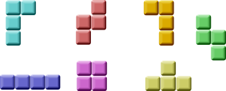
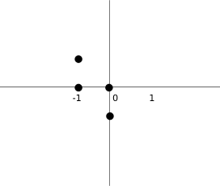

# PyQt5俄罗斯方块

这一节我们创建一个俄罗斯方块

> ## 俄罗斯方块

俄罗斯方块游戏是有史以来最受欢迎的电脑游戏。最初的游戏是由俄罗斯设计和编程的程序员阿列克谢帕基特诺夫于1985年。此后,俄罗斯方块是几乎所有的计算机平台上可用在很多变化。
俄罗斯方块称为积木拼图游戏。在这个游戏中,我们有七种不同形状叫tetrominoes:“s”形,Z-shape,t形,一个l型的空间,一个线,MirroredL-shape和正方形。这些形状的形成有四个方格。形状是跌倒。俄罗斯方块游戏的对象是移动和旋转的形状使他们适合尽可能多。如果我们设法形成一个行,该行摧毁我们得分。我们直到我们玩俄罗斯方块游戏。



PyQt5是一种用于创建应用程序的工具。还有其他的库是针对创建电脑游戏。然而,PyQt5和其他应用程序工具包可以用来创建简单的游戏。
创建一个电脑游戏是一个提高编程技能的很好的方发。

> ## 开发

在俄罗斯方块中没有图片，我们使用PyQt5编程工具包绘图API中绘制图形。每一个电脑游戏的背后,都有一个数学模型。在俄罗斯方块中更是如此。

游戏的一些思想:
我们使用QtCore.QBasicTimer()来创建一个游戏循环。
俄罗斯方块是绘制的。
图形是一个方块一个方块移动的（不是像素）
图形其实是一个简单的数字列表。

代码包括四类:Tetris, Board, Tetrominoe 和Shape。Tetris 类用来存放游戏。Board是编写游戏逻辑的地方。Tetrominoe类包含所有俄罗斯方块的名称，Shape类包含一个俄罗斯方块的代码。

```python
# -*- coding: utf-8 -*-

"""
PyQt5 tutorial

This is a Tetris game clone..

author: py40.com
last edited: 2017年3月
"""
import sys, random
from PyQt5.QtWidgets import QMainWindow, QFrame, QDesktopWidget, QApplication
from PyQt5.QtCore import Qt, QBasicTimer, pyqtSignal
from PyQt5.QtGui import QPainter, QColor


class Tetris(QMainWindow):
    def __init__(self):
        super().__init__()

        self.initUI()

    def initUI(self):
        self.tboard = Board(self)
        self.setCentralWidget(self.tboard)

        self.statusbar = self.statusBar()
        self.tboard.msg2Statusbar[str].connect(self.statusbar.showMessage)

        self.tboard.start()

        self.resize(180, 380)
        self.center()
        self.setWindowTitle('Tetris')
        self.show()

    def center(self):
        screen = QDesktopWidget().screenGeometry()
        size = self.geometry()
        self.move((screen.width() - size.width()) / 2,
                  (screen.height() - size.height()) / 2)


class Board(QFrame):
    msg2Statusbar = pyqtSignal(str)

    BoardWidth = 10
    BoardHeight = 22
    Speed = 300

    def __init__(self, parent):
        super().__init__(parent)

        self.initBoard()

    def initBoard(self):

        self.timer = QBasicTimer()
        self.isWaitingAfterLine = False

        self.curX = 0
        self.curY = 0
        self.numLinesRemoved = 0
        self.board = []

        self.setFocusPolicy(Qt.StrongFocus)
        self.isStarted = False
        self.isPaused = False
        self.clearBoard()

    def shapeAt(self, x, y):
        return self.board[(y * Board.BoardWidth) + x]

    def setShapeAt(self, x, y, shape):
        self.board[(y * Board.BoardWidth) + x] = shape

    def squareWidth(self):
        return self.contentsRect().width() // Board.BoardWidth

    def squareHeight(self):
        return self.contentsRect().height() // Board.BoardHeight

    def start(self):

        if self.isPaused:
            return

        self.isStarted = True
        self.isWaitingAfterLine = False
        self.numLinesRemoved = 0
        self.clearBoard()

        self.msg2Statusbar.emit(str(self.numLinesRemoved))

        self.newPiece()
        self.timer.start(Board.Speed, self)

    def pause(self):

        if not self.isStarted:
            return

        self.isPaused = not self.isPaused

        if self.isPaused:
            self.timer.stop()
            self.msg2Statusbar.emit("paused")

        else:
            self.timer.start(Board.Speed, self)
            self.msg2Statusbar.emit(str(self.numLinesRemoved))

        self.update()

    def paintEvent(self, event):

        painter = QPainter(self)
        rect = self.contentsRect()

        boardTop = rect.bottom() - Board.BoardHeight * self.squareHeight()

        for i in range(Board.BoardHeight):
            for j in range(Board.BoardWidth):
                shape = self.shapeAt(j, Board.BoardHeight - i - 1)

                if shape != Tetrominoe.NoShape:
                    self.drawSquare(painter,
                                    rect.left() + j * self.squareWidth(),
                                    boardTop + i * self.squareHeight(), shape)

        if self.curPiece.shape() != Tetrominoe.NoShape:

            for i in range(4):
                x = self.curX + self.curPiece.x(i)
                y = self.curY - self.curPiece.y(i)
                self.drawSquare(painter, rect.left() + x * self.squareWidth(),
                                boardTop + (Board.BoardHeight - y - 1) * self.squareHeight(),
                                self.curPiece.shape())

    def keyPressEvent(self, event):

        if not self.isStarted or self.curPiece.shape() == Tetrominoe.NoShape:
            super(Board, self).keyPressEvent(event)
            return

        key = event.key()

        if key == Qt.Key_P:
            self.pause()
            return

        if self.isPaused:
            return

        elif key == Qt.Key_Left:
            self.tryMove(self.curPiece, self.curX - 1, self.curY)

        elif key == Qt.Key_Right:
            self.tryMove(self.curPiece, self.curX + 1, self.curY)

        elif key == Qt.Key_Down:
            self.tryMove(self.curPiece.rotateRight(), self.curX, self.curY)

        elif key == Qt.Key_Up:
            self.tryMove(self.curPiece.rotateLeft(), self.curX, self.curY)

        elif key == Qt.Key_Space:
            self.dropDown()

        elif key == Qt.Key_D:
            self.oneLineDown()

        else:
            super(Board, self).keyPressEvent(event)

    def timerEvent(self, event):

        if event.timerId() == self.timer.timerId():

            if self.isWaitingAfterLine:
                self.isWaitingAfterLine = False
                self.newPiece()
            else:
                self.oneLineDown()

        else:
            super(Board, self).timerEvent(event)

    def clearBoard(self):

        for i in range(Board.BoardHeight * Board.BoardWidth):
            self.board.append(Tetrominoe.NoShape)

    def dropDown(self):

        newY = self.curY

        while newY > 0:

            if not self.tryMove(self.curPiece, self.curX, newY - 1):
                break

            newY -= 1

        self.pieceDropped()

    def oneLineDown(self):

        if not self.tryMove(self.curPiece, self.curX, self.curY - 1):
            self.pieceDropped()

    def pieceDropped(self):

        for i in range(4):
            x = self.curX + self.curPiece.x(i)
            y = self.curY - self.curPiece.y(i)
            self.setShapeAt(x, y, self.curPiece.shape())

        self.removeFullLines()

        if not self.isWaitingAfterLine:
            self.newPiece()

    def removeFullLines(self):

        numFullLines = 0
        rowsToRemove = []

        for i in range(Board.BoardHeight):

            n = 0
            for j in range(Board.BoardWidth):
                if not self.shapeAt(j, i) == Tetrominoe.NoShape:
                    n = n + 1

            if n == 10:
                rowsToRemove.append(i)

        rowsToRemove.reverse()

        for m in rowsToRemove:

            for k in range(m, Board.BoardHeight):
                for l in range(Board.BoardWidth):
                    self.setShapeAt(l, k, self.shapeAt(l, k + 1))

        numFullLines = numFullLines + len(rowsToRemove)

        if numFullLines > 0:
            self.numLinesRemoved = self.numLinesRemoved + numFullLines
            self.msg2Statusbar.emit(str(self.numLinesRemoved))

            self.isWaitingAfterLine = True
            self.curPiece.setShape(Tetrominoe.NoShape)
            self.update()

    def newPiece(self):

        self.curPiece = Shape()
        self.curPiece.setRandomShape()
        self.curX = Board.BoardWidth // 2 + 1
        self.curY = Board.BoardHeight - 1 + self.curPiece.minY()

        if not self.tryMove(self.curPiece, self.curX, self.curY):
            self.curPiece.setShape(Tetrominoe.NoShape)
            self.timer.stop()
            self.isStarted = False
            self.msg2Statusbar.emit("Game over")

    def tryMove(self, newPiece, newX, newY):

        for i in range(4):

            x = newX + newPiece.x(i)
            y = newY - newPiece.y(i)

            if x < 0 or x >= Board.BoardWidth or y < 0 or y >= Board.BoardHeight:
                return False

            if self.shapeAt(x, y) != Tetrominoe.NoShape:
                return False

        self.curPiece = newPiece
        self.curX = newX
        self.curY = newY
        self.update()

        return True

    def drawSquare(self, painter, x, y, shape):

        colorTable = [0x000000, 0xCC6666, 0x66CC66, 0x6666CC,
                      0xCCCC66, 0xCC66CC, 0x66CCCC, 0xDAAA00]

        color = QColor(colorTable[shape])
        painter.fillRect(x + 1, y + 1, self.squareWidth() - 2,
                         self.squareHeight() - 2, color)

        painter.setPen(color.lighter())
        painter.drawLine(x, y + self.squareHeight() - 1, x, y)
        painter.drawLine(x, y, x + self.squareWidth() - 1, y)

        painter.setPen(color.darker())
        painter.drawLine(x + 1, y + self.squareHeight() - 1,
                         x + self.squareWidth() - 1, y + self.squareHeight() - 1)
        painter.drawLine(x + self.squareWidth() - 1,
                         y + self.squareHeight() - 1, x + self.squareWidth() - 1, y + 1)


class Tetrominoe(object):
    NoShape = 0
    ZShape = 1
    SShape = 2
    LineShape = 3
    TShape = 4
    SquareShape = 5
    LShape = 6
    MirroredLShape = 7


class Shape(object):
    coordsTable = (
        ((0, 0), (0, 0), (0, 0), (0, 0)),
        ((0, -1), (0, 0), (-1, 0), (-1, 1)),
        ((0, -1), (0, 0), (1, 0), (1, 1)),
        ((0, -1), (0, 0), (0, 1), (0, 2)),
        ((-1, 0), (0, 0), (1, 0), (0, 1)),
        ((0, 0), (1, 0), (0, 1), (1, 1)),
        ((-1, -1), (0, -1), (0, 0), (0, 1)),
        ((1, -1), (0, -1), (0, 0), (0, 1))
    )

    def __init__(self):

        self.coords = [[0, 0] for i in range(4)]
        self.pieceShape = Tetrominoe.NoShape

        self.setShape(Tetrominoe.NoShape)

    def shape(self):
        return self.pieceShape

    def setShape(self, shape):

        table = Shape.coordsTable[shape]

        for i in range(4):
            for j in range(2):
                self.coords[i][j] = table[i][j]

        self.pieceShape = shape

    def setRandomShape(self):
        self.setShape(random.randint(1, 7))

    def x(self, index):
        return self.coords[index][0]

    def y(self, index):
        return self.coords[index][1]

    def setX(self, index, x):
        self.coords[index][0] = x

    def setY(self, index, y):
        self.coords[index][1] = y

    def minX(self):

        m = self.coords[0][0]
        for i in range(4):
            m = min(m, self.coords[i][0])

        return m

    def maxX(self):

        m = self.coords[0][0]
        for i in range(4):
            m = max(m, self.coords[i][0])

        return m

    def minY(self):

        m = self.coords[0][1]
        for i in range(4):
            m = min(m, self.coords[i][1])

        return m

    def maxY(self):

        m = self.coords[0][1]
        for i in range(4):
            m = max(m, self.coords[i][1])

        return m

    def rotateLeft(self):

        if self.pieceShape == Tetrominoe.SquareShape:
            return self

        result = Shape()
        result.pieceShape = self.pieceShape

        for i in range(4):
            result.setX(i, self.y(i))
            result.setY(i, -self.x(i))

        return result

    def rotateRight(self):

        if self.pieceShape == Tetrominoe.SquareShape:
            return self

        result = Shape()
        result.pieceShape = self.pieceShape

        for i in range(4):
            result.setX(i, -self.y(i))
            result.setY(i, self.x(i))

        return result


if __name__ == '__main__':
    app = QApplication([])
    tetris = Tetris()
    sys.exit(app.exec_())
```

游戏简化一点,让它更容易理解。在比赛开始后立即启动。我们可以通过按p键暂停游戏。空格键将立即把俄罗斯方块块底部。游戏是在恒定速度,实现没有加速度。分数是我们已经删除的行数。

```python
self.tboard = Board(self)
self.setCentralWidget(self.tboard)
```

Board创建一个面板类的实例，并设置应用程序的核心部件。

```python
self.statusbar = self.statusBar()        
self.tboard.msg2Statusbar[str].connect(self.statusbar.showMessage)
```

我们创建一个状态栏将显示消息。我们将显示三种可能的消息:已删除的行数,停顿了一下消息,或游戏结束的消息。msg2Statusbar是一个自定义的信号,在Board 中实现类。showMessage()是一个内置的方法,在状态栏显示一条消息。

```python
self.tboard.start()
```

这一行代码启动游戏

```python
class Board(QFrame):
    
    msg2Statusbar = pyqtSignal(str)
...    
```

创建一个自定义的信号。当我们想写一个信息或状态栏的分数的时候，msg2Statusbar发出一个信号

```python
BoardWidth = 10
BoardHeight = 22
Speed = 300
```

这些都是Board的类变量。BoardWidth和BoardHeight定义的块的大小。Speed定义了游戏的速度。每个300 ms将开始一个新游戏循环。

```python
...
self.curX = 0
self.curY = 0
self.numLinesRemoved = 0
self.board = []
...
```

我们在initBoard()方法初始化一些重要的变量。board变量是一个从0到7的数字列表。它代表了面板上各种形状和位置。

```python
def shapeAt(self, x, y):
    return self.board[(y * Board.BoardWidth) + x]
```

shapeAt()方法确定在给定形状块的类型。

```python
def squareWidth(self):
    return self.contentsRect().width() // Board.BoardWidth
```

Board可以动态地调整大小。因此,块的大小可能会有所改变。squareWidth()计算单一方块像素的宽度并返回它。Board.BoardWidth方块板的大小。

```python
for i in range(Board.BoardHeight):
    for j in range(Board.BoardWidth):
        shape = self.shapeAt(j, Board.BoardHeight - i - 1)
        
        if shape != Tetrominoe.NoShape:
            self.drawSquare(painter,
                rect.left() + j * self.squareWidth(),
                boardTop + i * self.squareHeight(), shape)
```

游戏的绘制分为两个步骤，第一步，绘制所有方块，这些方块都要保存在底部列表中。列表通过shapeAt() 方法来添加方块。

```python
if self.curPiece.shape() != Tetrominoe.NoShape:
    
    for i in range(4):
        
        x = self.curX + self.curPiece.x(i)
        y = self.curY - self.curPiece.y(i)
        self.drawSquare(painter, rect.left() + x * self.squareWidth(),
            boardTop + (Board.BoardHeight - y - 1) * self.squareHeight(),
            self.curPiece.shape())
```

第二步绘制下降中的方块

```python
elif key == Qt.Key_Right:
    self.tryMove(self.curPiece, self.curX + 1, self.curY)
```

keyPressEvent()方法检查按下键。当按右箭头键,我们试图向右移动一块。我们使用tyrMove,因为可能无法移动。

```python
elif key == Qt.Key_Up:
    self.tryMove(self.curPiece.rotateLeft(), self.curX, self.curY)
```

向上箭头键将旋转方块。

```python
elif key == Qt.Key_Space:
    self.dropDown()
```

空格键立即下降到底部

```python
elif key == Qt.Key_D:
    self.oneLineDown()
```

按下D键，可以加速下降。

```python
def tryMove(self, newPiece, newX, newY):
    
    for i in range(4):
        
        x = newX + newPiece.x(i)
        y = newY - newPiece.y(i)
        
        if x < 0 or x >= Board.BoardWidth or y < 0 or y >= Board.BoardHeight:
            return False
            
        if self.shapeAt(x, y) != Tetrominoe.NoShape:
            return False

    self.curPiece = newPiece
    self.curX = newX
    self.curY = newY
    self.update()
    return True
```

使用tryMove()方法尝试移动方块。如果方块的边缘已经接触到面板边缘或者不能移动,我们返回False。否则我们当前块下降到一个新的位置。

```python
def timerEvent(self, event):
    
    if event.timerId() == self.timer.timerId():
        
        if self.isWaitingAfterLine:
            self.isWaitingAfterLine = False
            self.newPiece()
        else:
            self.oneLineDown()
            
    else:
        super(Board, self).timerEvent(event)
```

计时器事件,当我们前一个方块降到底部后，创建一个新的方块。

```python
def clearBoard(self):
    
    for i in range(Board.BoardHeight * Board.BoardWidth):
        self.board.append(Tetrominoe.NoShape)
```

clearBoard()方法通过设置Tetrominoe.NoShape清除面板

```python
def removeFullLines(self):
    
    numFullLines = 0
    rowsToRemove = []

    for i in range(Board.BoardHeight):
        
        n = 0
        for j in range(Board.BoardWidth):
            if not self.shapeAt(j, i) == Tetrominoe.NoShape:
                n = n + 1

        if n == 10:
            rowsToRemove.append(i)

    rowsToRemove.reverse()
    

    for m in rowsToRemove:
        
        for k in range(m, Board.BoardHeight):
            for l in range(Board.BoardWidth):
                    self.setShapeAt(l, k, self.shapeAt(l, k + 1))

    numFullLines = numFullLines + len(rowsToRemove)
 ...
```

如果到达底部,会调用removeFullLines()方法。我们会检查所有完整的线条然后删除它们。然后移动所有行高于当前删除整行一行。请注意,我们反的顺序行被删除。否则,就会出错。

```python
def newPiece(self):
    
    self.curPiece = Shape()
    self.curPiece.setRandomShape()
    self.curX = Board.BoardWidth // 2 + 1
    self.curY = Board.BoardHeight - 1 + self.curPiece.minY()
    
    if not self.tryMove(self.curPiece, self.curX, self.curY):
        
        self.curPiece.setShape(Tetrominoe.NoShape)
        self.timer.stop()
        self.isStarted = False
        self.msg2Statusbar.emit("Game over")
```

通过newPiece()方法创建一个新的方块，如果不能进入它的初始位置,游戏就结束了。

```python
class Tetrominoe(object):
    
    NoShape = 0
    ZShape = 1
    SShape = 2
    LineShape = 3
    TShape = 4
    SquareShape = 5
    LShape = 6
    MirroredLShape = 7
```

Tetrominoe类包含所有可能的形状。NoShape空形状。
Shape 类保存方块信息

```python
class Shape(object):
    
    coordsTable = (
        ((0, 0),     (0, 0),     (0, 0),     (0, 0)),
        ((0, -1),    (0, 0),     (-1, 0),    (-1, 1)),
        ...
    )
...    
```

coordsTable 元组包含所有可能的俄罗斯方块的坐标值。这是一个模板的所有块坐标值。

```python
self.coords = [[0,0] for i in range(4)]
```

我们创建一个空的列表保存俄罗斯方块的坐标



上面的图像将有助于理解坐标值。例如,元组(0,1),(0,0)、(1,0)、(1,1)代表Z-shape。图表说明了形状

```python
def rotateLeft(self):
    
    if self.pieceShape == Tetrominoe.SquareShape:
        return self

    result = Shape()
    result.pieceShape = self.pieceShape
    
    for i in range(4):
        
        result.setX(i, self.y(i))
        result.setY(i, -self.x(i))

    return result
```

rotateLeft() 向左旋转方块。如果方块本身不能被旋转，我们就返回当前对象的应用。否则就创建一个新的块及其坐标设置为的旋转。