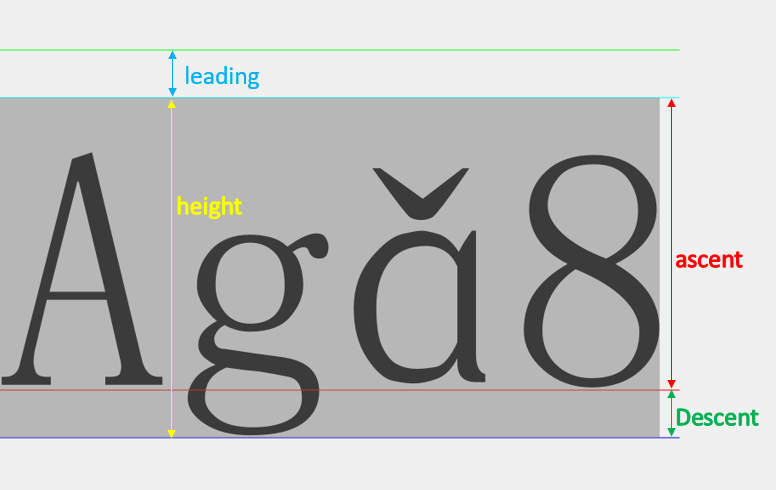

# QFontMetrics

参考博客:

[QFontMetrics](https://blog.csdn.net/kenfan1647/article/details/115171891)

[Qt 字体(01):文本尺寸的常见参数解释](https://blog.csdn.net/hitzsf/article/details/108720460)

### 一、描述

QFontMetrics提供关于字体的指标信息。

QFontMetrics的函数用于计算给定字体的字符和字符串的大小。有三种方法可以创建QFontMetrics对象：

- 用QFont调用QFontMetrics构造函数会为屏幕兼容字体创建QFontMetrics对象，即字体不能是打印机字体。
- QWidget.fontMetrics()返回小部件字体的QFontMetrics。这相当于QFontMetrics（widget.font()）。
- QPainter.fontMetrics()返回painter当前字体的QFontMetrics。

### 二、文本尺寸的度量



```python
# 行高 lineSpacing = hegiht + leading 
QFontMetrics.lineSpacing()
# 行距 leading
QFontMetrics.leading()
# 基线以下高度 descent
QFontMetrics.descent()
# 基线以上高度 ascent
QFontMetrics.ascent()
# 高度 height
QFontMetrics.height()
# 导入src文本返回该文本以QFontMetrics类所包含的font为格式的Rect，
# boundingRect 的高度和height一致，但宽度有点偏窄
QFontMetrics.boundingRect(str)
# 导入src文本返回该文本以QFontMetrics类所包含的font为格式的宽度，
# QFontMetrics.width(str)函数和该函数功能貌似一样，不过horizontalAdvance是新版本加的，建议用这个
QFontMetrics.horizontalAdvance(str)

```

