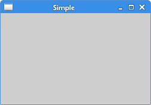
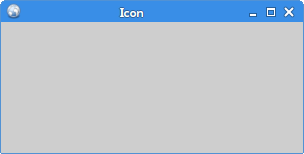
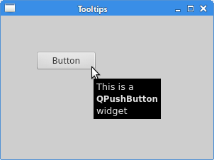
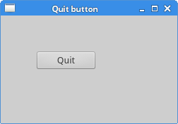
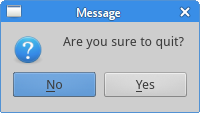

# PyQt5基本功能

这一节我们介绍PyQT5的基础知识

## 简单的例子

PyQt5是一种高级的语言，下面只有几行代码就能显示一个小窗口。底层已经实现了窗口的基本功能。

```python
#!/usr/bin/python3
# -*- coding: utf-8 -*-
import sys

#这里我们提供必要的引用。基本控件位于pyqt5.qtwidgets模块中。
from PyQt5.QtWidgets import QApplication, QWidget


if __name__ == '__main__':
    #每一pyqt5应用程序必须创建一个应用程序对象。sys.argv参数是一个列表，从命令行输入参数。
    app = QApplication(sys.argv)
    #QWidget部件是pyqt5所有用户界面对象的基类。他为QWidget提供默认构造函数。默认构造函数没有父类。
    w = QWidget()
    #resize()方法调整窗口的大小。这离是250px宽150px高
    w.resize(250, 150)
    #move()方法移动窗口在屏幕上的位置到x = 300，y = 300坐标。
    w.move(300, 300)
    #设置窗口的标题
    w.setWindowTitle('Simple')
    #显示在屏幕上
    w.show()
    
    #系统exit()方法确保应用程序干净的退出
    #的exec_()方法有下划线。因为执行是一个Python关键词。因此，exec_()代替
    sys.exit(app.exec_())
```

上面的示例代码在屏幕上显示一个小窗口。



## 应用程序的图标

应用程序图标是一个小的图像，通常在标题栏的左上角显示。在下面的例子中我们将介绍如何做pyqt5的图标。同时我们也将介绍一些新方法。

```python
#!/usr/bin/python3
# -*- coding: utf-8 -*-

import sys
from PyQt5.QtWidgets import QApplication, QWidget
from PyQt5.QtGui import QIcon


class Example(QWidget):
    
    def __init__(self):
        super().__init__()
        
        self.initUI() #界面绘制交给InitUi方法
        
        
    def initUI(self):
        #设置窗口的位置和大小
        self.setGeometry(300, 300, 300, 220)  
        #设置窗口的标题
        self.setWindowTitle('Icon')
        #设置窗口的图标，引用当前目录下的web.png图片
        self.setWindowIcon(QIcon('web.png'))        
        
        #显示窗口
        self.show()
        
        
if __name__ == '__main__':
    #创建应用程序和对象
    app = QApplication(sys.argv)
    ex = Example()
    sys.exit(app.exec_()) 
```

前面的例子是在程序风格。Python编程语言支持程序和面向对象编程风格。Pyqt5使用OOP编程。

```python
class Example(QWidget):
    
    def __init__(self):
        super().__init__()
        ...
```

面向对象编程有三个重要的方面：类、变量和方法。这里我们创建一个新的类为Examle。Example继承自QWidget类。



## 显示提示语

在下面的例子中我们显示一个提示语

```python
#!/usr/bin/python3
# -*- coding: utf-8 -*-

import sys
from PyQt5.QtWidgets import (QWidget, QToolTip, 
    QPushButton, QApplication)
from PyQt5.QtGui import QFont    


class Example(QWidget):
    
    def __init__(self):
        super().__init__()
        
        self.initUI()
        
        
    def initUI(self):
        #这种静态的方法设置一个用于显示工具提示的字体。我们使用10px滑体字体。
        QToolTip.setFont(QFont('SansSerif', 10))
        
        #创建一个提示，我们称之为settooltip()方法。我们可以使用丰富的文本格式
        self.setToolTip('This is a <b>QWidget</b> widget')
        
        #创建一个PushButton并为他设置一个tooltip
        btn = QPushButton('Button', self)
        btn.setToolTip('This is a <b>QPushButton</b> widget')
        
        #btn.sizeHint()显示默认尺寸
        btn.resize(btn.sizeHint())
        
        #移动窗口的位置
        btn.move(50, 50)       
        
        self.setGeometry(300, 300, 300, 200)
        self.setWindowTitle('Tooltips')    
        self.show()
        
        
if __name__ == '__main__':
    
    app = QApplication(sys.argv)
    ex = Example()
    sys.exit(app.exec_())
```

运行程序，显示一个窗口



## 关闭窗口

关闭一个窗口可以点击标题栏上的X。在下面的例子中，我们将展示我们如何通过编程来关闭窗口。

```python
#!/usr/bin/python3
# -*- coding: utf-8 -*-

import sys
from PyQt5.QtWidgets import QWidget, QPushButton, QApplication
from PyQt5.QtCore import QCoreApplication


class Example(QWidget):
    
    def __init__(self):
        super().__init__()
        
        self.initUI()
        
        
    def initUI(self):               
        
        qbtn = QPushButton('Quit', self)
        qbtn.clicked.connect(QCoreApplication.instance().quit)
        qbtn.resize(qbtn.sizeHint())
        qbtn.move(50, 50)       
        
        self.setGeometry(300, 300, 250, 150)
        self.setWindowTitle('Quit button')    
        self.show()
        
        
if __name__ == '__main__':
    
    app = QApplication(sys.argv)
    ex = Example()
    sys.exit(app.exec_())
```



## 消息框

默认情况下,如果我们单击x按钮窗口就关门了。有时我们想修改这个默认的行为。例如我们在编辑器中修改了一个文件,当关闭他的时候，我们显示一个消息框确认。

```python
#!/usr/bin/python3
# -*- coding: utf-8 -*-

import sys
from PyQt5.QtWidgets import QWidget, QMessageBox, QApplication


class Example(QWidget):
    
    def __init__(self):
        super().__init__()
        
        self.initUI()
        
        
    def initUI(self):               
        
        self.setGeometry(300, 300, 250, 150)        
        self.setWindowTitle('Message box')    
        self.show()
        
        
    def closeEvent(self, event):
        
        reply = QMessageBox.question(self, 'Message',
            "Are you sure to quit?", QMessageBox.Yes | 
            QMessageBox.No, QMessageBox.No)

        if reply == QMessageBox.Yes:
            event.accept()
        else:
            event.ignore()        
        
        
if __name__ == '__main__':
    
    app = QApplication(sys.argv)
    ex = Example()
    sys.exit(app.exec_())
```

我们关闭窗口的时候,触发了QCloseEvent。我们需要重写closeEvent()事件处理程序。

```python
reply = QMessageBox.question(self, 'Message',
    "Are you sure to quit?", QMessageBox.Yes | 
    QMessageBox.No, QMessageBox.No)
```

我们显示一个消息框,两个按钮:“是”和“不是”。第一个字符串出现在titlebar。第二个字符串消息对话框中显示的文本。第三个参数指定按钮的组合出现在对话框中。最后一个参数是默认按钮，这个是默认的按钮焦点。

```python
if reply == QtGui.QMessageBox.Yes:
    event.accept()
else:
    event.ignore()  
```

我们处理返回值，如果单击Yes按钮,关闭小部件并终止应用程序。否则我们忽略关闭事件。



## 窗口显示在屏幕的中间

下面的脚本显示了如何在屏幕中心显示窗口。

```python
#!/usr/bin/python3
# -*- coding: utf-8 -*-

import sys
from PyQt5.QtWidgets import QWidget, QDesktopWidget, QApplication


class Example(QWidget):
    
    def __init__(self):
        super().__init__()
        
        self.initUI()
        
        
    def initUI(self):               
        
        self.resize(250, 150)
        self.center()
        
        self.setWindowTitle('Center')    
        self.show()
        
    
    #控制窗口显示在屏幕中心的方法    
    def center(self):
        
        #获得窗口
        qr = self.frameGeometry()
        #获得屏幕中心点
        cp = QDesktopWidget().availableGeometry().center()
        #显示到屏幕中心
        qr.moveCenter(cp)
        self.move(qr.topLeft())
        
        
if __name__ == '__main__':
    
    app = QApplication(sys.argv)
    ex = Example()
    sys.exit(app.exec_())  
```

QtGui,QDesktopWidget类提供了用户的桌面信息,包括屏幕大小。

ps：下面是获取当前屏幕分辨率的方法

```python
# 获取当前屏幕分辨率
screen = PyQt5.QtGui.QGuiApplication.primaryScreen()
mm = screen.availableGeometry()
screen_width = mm.width()
screen_height = mm.height()
```

