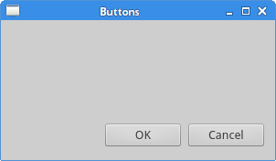
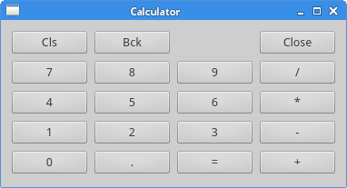
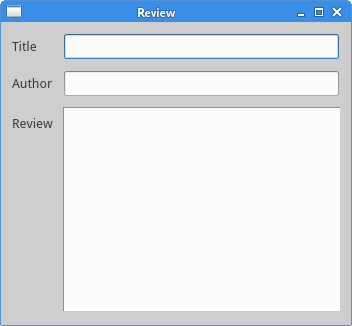

# PyQt5布局管理

PyQt5布局有两种方式，绝对定位和布局类

> ## 绝对定位

程序指定每个控件的位置和大小(以像素为单位)。

绝对定位有以下限制:

- 如果我们调整窗口，控件的大小和位置不会改变
- 在各种平台上应用程序看起来会不一样
- 如果改变字体，我们的应用程序的布局就会改变
- 如果我们决定改变我们的布局,我们必须完全重做我们的布局

下面的例子显示了一个绝对定位

```python
#!/usr/bin/python3
# -*- coding: utf-8 -*-

"""
Py40 PyQt5 tutorial 

This example shows three labels on a window
using absolute positioning. 

author: Jan Bodnar
website: py40.com 
last edited: January 2015
"""

import sys
from PyQt5.QtWidgets import QWidget, QLabel, QApplication


class Example(QWidget):
    
    def __init__(self):
        super().__init__()
        
        self.initUI()
        
        
    def initUI(self):
        
        lbl1 = QLabel('Zetcode', self)
        lbl1.move(15, 10)

        lbl2 = QLabel('tutorials', self)
        lbl2.move(35, 40)
        
        lbl3 = QLabel('for programmers', self)
        lbl3.move(55, 70)        
        
        self.setGeometry(300, 300, 250, 150)
        self.setWindowTitle('Absolute')    
        self.show()
        
        
if __name__ == '__main__':
    
    app = QApplication(sys.argv)
    ex = Example()
    sys.exit(app.exec_())
```

我们使用move()方法来控制控件的位置。

> ## 框布局 Boxlayout

我们使用QHBoxLayout和QVBoxLayout，来分别创建横向布局和纵向布局。

```python
#!/usr/bin/python3
# -*- coding: utf-8 -*-

import sys
from PyQt5.QtWidgets import (QWidget, QPushButton, 
    QHBoxLayout, QVBoxLayout, QApplication)


class Example(QWidget):
    
    def __init__(self):
        super().__init__()
        
        self.initUI()
        
        
    def initUI(self):
        
        okButton = QPushButton("OK")
        cancelButton = QPushButton("Cancel")

        hbox = QHBoxLayout()
        hbox.addStretch(1)
        hbox.addWidget(okButton)
        hbox.addWidget(cancelButton)

        vbox = QVBoxLayout()
        vbox.addStretch(1)
        vbox.addLayout(hbox)
        
        self.setLayout(vbox)    
        
        self.setGeometry(300, 300, 300, 150)
        self.setWindowTitle('Buttons')    
        self.show()
        
        
if __name__ == '__main__':
    
    app = QApplication(sys.argv)
    ex = Example()
    sys.exit(app.exec_())
```

在这个例子中，我们使用HBoxLayout和QVBoxLayout并添加伸展因子，在窗口的右下角显示两个按钮。

```python
hbox = QHBoxLayout()
hbox.addStretch(1)
hbox.addWidget(okButton)
hbox.addWidget(cancelButton)
```

我们创建一个水平布局和添加一个伸展因子和两个按钮。两个按钮前的伸展增加了一个可伸缩的空间。这将推动他们靠右显示。

```python
vbox = QVBoxLayout()
vbox.addStretch(1)
vbox.addLayout(hbox)
```

创建一个垂直布局，并添加伸展因子，让水平布局显示在窗口底部

```python
self.setLayout(vbox)
```

最后,我们设置窗口的布局界面



该节中出现的QHBoxLayout、QVBoxLayout以及Stretch的概念可以参考这两个博客

**QHBoxLayout** 参考这篇博客 [Qt 水平布局(QHBoxLayout)](https://blog.csdn.net/weixin_42837024/article/details/82114258)

**QVBoxLayout** 参考这篇博客 [Qt 垂直布局(QVBoxLayout)](https://shenmingyi.blog.csdn.net/article/details/82114716)

> ## 表格布局 QGridLayout

关于QGridLayout更详细的介绍参考这篇博客 [Qt 布局管理器(QGridLayout)](https://blog.csdn.net/tqs_1220/article/details/81842878)

表格布局将空间划分为行和列。我们使用QGridLayout类创建一个网格布局。

```python
#!/usr/bin/python3
# -*- coding: utf-8 -*-

import sys
from PyQt5.QtWidgets import (QWidget, QGridLayout, 
    QPushButton, QApplication)


class Example(QWidget):
    
    def __init__(self):
        super().__init__()
        
        self.initUI()
        
        
    def initUI(self):
        
        grid = QGridLayout()
        self.setLayout(grid)
 
        names = ['Cls', 'Bck', '', 'Close',
                 '7', '8', '9', '/',
                '4', '5', '6', '*',
                 '1', '2', '3', '-',
                '0', '.', '=', '+']
        
        positions = [(i,j) for i in range(5) for j in range(4)]
        
        for position, name in zip(positions, names):
            
            if name == '':
                continue
            button = QPushButton(name)
            grid.addWidget(button, *position)
            
        self.move(300, 150)
        self.setWindowTitle('Calculator')
        self.show()
        
        
if __name__ == '__main__':
    
    app = QApplication(sys.argv)
    ex = Example()
    sys.exit(app.exec_())
```

在我们的示例中,我们创建一个网格的按钮。

```python
grid = QGridLayout()
self.setLayout(grid)
```

QGridLayout的实例被创建并设置应用程序窗口的布局。

```python
names = ['Cls', 'Bck', '', 'Close',
            '7', '8', '9', '/',
        '4', '5', '6', '*',
            '1', '2', '3', '-',
        '0', '.', '=', '+']
```

这些按钮的标签。

```python
positions = [(i,j) for i in range(5) for j in range(4)]
```

我们创建一个网格中的位置的列表。

```python
for position, name in zip(positions, names):
    
    if name == '':
        continue
    button = QPushButton(name)
    grid.addWidget(button, *position)
```

创建按钮并使用addWidget()方法添加到布局中。



> ## 评论的例子


```python
#!/usr/bin/python3
# -*- coding: utf-8 -*-

import sys
from PyQt5.QtWidgets import (QWidget, QLabel, QLineEdit, 
    QTextEdit, QGridLayout, QApplication)


class Example(QWidget):
    
    def __init__(self):
        super().__init__()
        
        self.initUI()
        
        
    def initUI(self):
        
        title = QLabel('Title')
        author = QLabel('Author')
        review = QLabel('Review')

        titleEdit = QLineEdit()
        authorEdit = QLineEdit()
        reviewEdit = QTextEdit()

        grid = QGridLayout()
        grid.setSpacing(10)

        grid.addWidget(title, 1, 0)
        grid.addWidget(titleEdit, 1, 1)

        grid.addWidget(author, 2, 0)
        grid.addWidget(authorEdit, 2, 1)

        grid.addWidget(review, 3, 0)
        grid.addWidget(reviewEdit, 3, 1, 5, 1)
        
        self.setLayout(grid) 
        
        self.setGeometry(300, 300, 350, 300)
        self.setWindowTitle('Review')    
        self.show()
        
        
if __name__ == '__main__':
    
    app = QApplication(sys.argv)
    ex = Example()
    sys.exit(app.exec_())
```

我们创建一个窗口,其中有三个标签,两个行编辑和一个文本编辑窗口小控件。然后使用QGridLayout完成布局。

```python
grid = QGridLayout()
grid.setSpacing(10)
```

创建一个网格布局和设置组件之间的间距。

```python
grid.addWidget(reviewEdit, 3, 1, 5, 1)
```

在添加一个小的控件到网格的时候,我们可以提供小部件的行和列跨。在例子中,reviewEdit控件跨度5行。

