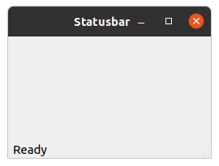
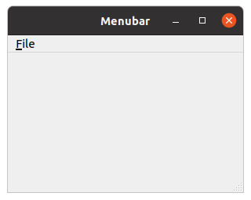
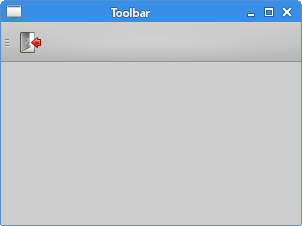
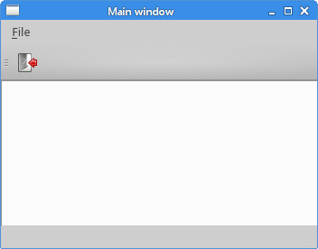

# PyQt5菜单和工具栏

在这部分PyQt5教程中,我们将创建菜单和工具栏。

> ## 主窗口

QMainWindow 类提供了一个主要的应用程序窗口。你用它可以让应用程序添加状态栏,工具栏和菜单栏。

> ## 状态栏

状态栏用于显示状态信息。

```python
#!/usr/bin/python3
# -*- coding: utf-8 -*-

import sys
from PyQt5.QtWidgets import QMainWindow, QApplication


class Example(QMainWindow):
    
    def __init__(self):
        super().__init__()
        
        self.initUI()
        
        
    def initUI(self):               
        
        self.statusBar().showMessage('Ready')
        
        self.setGeometry(300, 300, 250, 150)
        self.setWindowTitle('Statusbar')    
        self.show()


if __name__ == '__main__':
    
    app = QApplication(sys.argv)
    ex = Example()
    sys.exit(app.exec_())
```

你用QMainWindow创建状态栏的小窗口。

```python
self.statusBar().showMessage('Ready')
```

QMainWindow类第一次调用statusBar()方法创建一个状态栏。后续调用返回的状态栏对象。showMessage()状态栏上显示一条消息。



> ## 菜单栏

菜单栏是常见的窗口应用程序的一部分。(Mac OS将菜单条不同。得到类似的结果,我们可以添加以下行:menubar.setNativeMenuBar(False)。)

```python
#!/usr/bin/python3
# -*- coding: utf-8 -*-

import sys
from PyQt5.QtWidgets import QMainWindow, QAction, qApp, QApplication
from PyQt5.QtGui import QIcon


class Example(QMainWindow):
    
    def __init__(self):
        super().__init__()
        
        self.initUI()
        
        
    def initUI(self):               
        
        exitAction = QAction(QIcon('exit.png'), '&Exit', self)        
        exitAction.setShortcut('Ctrl+Q')
        exitAction.setStatusTip('Exit application')
        exitAction.triggered.connect(qApp.quit)

        self.statusBar()

        #创建一个菜单栏
        menubar = self.menuBar()
        #添加菜单
        fileMenu = menubar.addMenu('&File')
        #添加事件
        fileMenu.addAction(exitAction)
        
        self.setGeometry(300, 300, 300, 200)
        self.setWindowTitle('Menubar')    
        self.show()
        
        
if __name__ == '__main__':
    
    app = QApplication(sys.argv)
    ex = Example()
    sys.exit(app.exec_())  
```

在上面的例子中,我们创建一个菜单栏和一个菜单。这个菜单将终止应用程序。Ctrl + Q的行动是可访问的快捷方式。



```python
exitAction = QAction(QIcon('exit.png'), '&Exit', self)        
exitAction.setShortcut('Ctrl+Q')
exitAction.setStatusTip('Exit application')
```

QAction可以操作菜单栏,工具栏,或自定义键盘快捷键。上面三行,我们创建一个事件和一个特定的图标和一个“退出”的标签。然后,在定义该操作的快捷键。
第三行创建一个鼠标指针悬停在该菜单项上时的提示。

```python
exitAction.triggered.connect(qApp.quit)
```

当我们点击菜单的时候，调用qApp.quit,终止应用程序。

PS：关于QAction的详细介绍，参考这篇博客 [QAction系列详解](https://blog.csdn.net/zhangbaoqiang1/article/details/81738760)

> ## 工具栏

工具栏提供了一个快速访问的入口。

```python
#!/usr/bin/python3
# -*- coding: utf-8 -*-

"""
Py40 PyQt5 tutorial 

This program creates a toolbar.
The toolbar has one action, which
terminates the application, if triggered.

author: Jan Bodnar
website: py40.com 
last edited: January 2015
"""

import sys
from PyQt5.QtWidgets import QMainWindow, QAction, qApp, QApplication
from PyQt5.QtGui import QIcon


class Example(QMainWindow):
    
    def __init__(self):
        super().__init__()
        
        self.initUI()
        
        
    def initUI(self):               
        
        exitAction = QAction(QIcon('exit24.png'), 'Exit', self)
        exitAction.setShortcut('Ctrl+Q')
        exitAction.triggered.connect(qApp.quit)
        
        self.toolbar = self.addToolBar('Exit')
        self.toolbar.addAction(exitAction)
        
        self.setGeometry(300, 300, 300, 200)
        self.setWindowTitle('Toolbar')    
        self.show()
        
        
if __name__ == '__main__':
    
    app = QApplication(sys.argv)
    ex = Example()
    sys.exit(app.exec_())
```

在上面的例子中,我们创建一个简单的工具栏。工具栏有有一个按钮,点击关闭窗口。

```python
exitAction = QAction(QIcon('exit24.png'), 'Exit', self)
exitAction.setShortcut('Ctrl+Q')
exitAction.triggered.connect(qApp.quit)
```

类似于上面的菜单栏的例子,我们创建一个QAction事件。该事件有一个标签、图标和快捷键。退出窗口的方法



> ## 把他们放在一起

在本节的最后一个例子中,我们将创建一个菜单条,工具栏和状态栏的小窗口

```python
#!/usr/bin/python3
# -*- coding: utf-8 -*-

"""
Py40 PyQt5 tutorial 

This program creates a skeleton of
a classic GUI application with a menubar,
toolbar, statusbar, and a central widget. 

author: Jan Bodnar
website: py40.com 
last edited: January 2015
"""

import sys
from PyQt5.QtWidgets import QMainWindow, QTextEdit, QAction, QApplication
from PyQt5.QtGui import QIcon


class Example(QMainWindow):
    
    def __init__(self):
        super().__init__()
        
        self.initUI()
        
        
    def initUI(self):               
        
        textEdit = QTextEdit()
        self.setCentralWidget(textEdit)

        exitAction = QAction(QIcon('exit24.png'), 'Exit', self)
        exitAction.setShortcut('Ctrl+Q')
        exitAction.setStatusTip('Exit application')
        exitAction.triggered.connect(self.close)

        self.statusBar()

        menubar = self.menuBar()
        fileMenu = menubar.addMenu('&File')
        fileMenu.addAction(exitAction)

        toolbar = self.addToolBar('Exit')
        toolbar.addAction(exitAction)
        
        self.setGeometry(300, 300, 350, 250)
        self.setWindowTitle('Main window')    
        self.show()
        
        
if __name__ == '__main__':
    
    app = QApplication(sys.argv)
    ex = Example()
    sys.exit(app.exec_())
```

创建了一个窗口

```python
textEdit = QTextEdit()
self.setCentralWidget(textEdit)
```

我们创建了一个QTextEdit,并把他设置为窗口的布局

