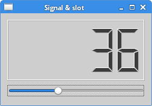
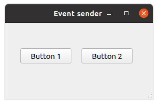
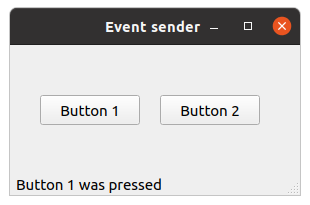
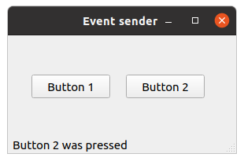

# PyQt5事件和信号

在这一部分的pyqt5教程中，我们将探讨PyQt5中的事件Event

> ## 事件 Event

所有的GUI程序都是事件驱动的。事件主要由用户触发，但也可能有其他触发方式：例如网络连接、window manager或定时器。当我们调用QApplication的exec_()方法时会使程序进入主循环。主循环会获取并分发事件。

在事件模型中，有三个参与者：

- 事件源
- 事件对象
- 事件接收者

事件源是状态发生变化的对象。它会生成事件。事件(对象)封装了事件源中状态的变动。事件接收者是要通知的对象。事件源对象将事件处理的工作交给事件接收者。

PyQt5有一个独特的signal&slot(信号槽)机制来处理事件。信号槽用于对象间的通信。signal在某一特定事件发生时被触发，slot可以是任何callable对象。当signal触发时会调用与之相连的slot。

> ## 信号槽 Signals & slots

这是一个使用信号槽的PyQt5例子。

```python
#!/usr/bin/python3
# -*- coding: utf-8 -*-

"""
Py40 PyQt5 tutorial 

In this example, we connect a signal
of a QSlider to a slot of a QLCDNumber. 

author: Jan Bodnar
website: py40.com 
last edited: January 2015
"""

import sys
from PyQt5.QtCore import Qt
from PyQt5.QtWidgets import (QWidget, QLCDNumber, QSlider, 
    QVBoxLayout, QApplication)


class Example(QWidget):
    
    def __init__(self):
        super().__init__()
        
        self.initUI()
        
        
    def initUI(self):
        
        lcd = QLCDNumber(self)
        sld = QSlider(Qt.Horizontal, self)

        vbox = QVBoxLayout()
        vbox.addWidget(lcd)
        vbox.addWidget(sld)

        self.setLayout(vbox)
        sld.valueChanged.connect(lcd.display)
        
        self.setGeometry(300, 300, 250, 150)
        self.setWindowTitle('Signal & slot')
        self.show()
        

if __name__ == '__main__':
    
    app = QApplication(sys.argv)
    ex = Example()
    sys.exit(app.exec_())
```

这个例子中展示了一个QtGui.QLCDNumber和QtGui.QSlider。lcd的值会随着滑块的拖动而改变。

```python
sld.valueChanged.connect(lcd.display)
```

在这里我们将滚动条的valueChanged信号连接到lcd的display插槽。

sender是发出信号的对象。receiver是接收信号的对象。slot(插槽)是对信号做出反应的方法。



> ## 重新实现事件处理器

在PyQt5中常通过重新实现事件处理器来处理事件。

```python
#!/usr/bin/python3
# -*- coding: utf-8 -*-

"""
pyu40 PyQt5 tutorial 

In this example, we reimplement an 
event handler. 

author: Jan Bodnar
website: py40.com 
last edited: January 2015
"""

import sys
from PyQt5.QtCore import Qt
from PyQt5.QtWidgets import QWidget, QApplication


class Example(QWidget):
    
    def __init__(self):
        super().__init__()
        
        self.initUI()
        
        
    def initUI(self):      
        
        self.setGeometry(300, 300, 250, 150)
        self.setWindowTitle('Event handler')
        self.show()
        
        
    def keyPressEvent(self, e):
        
        if e.key() == Qt.Key_Escape:
            self.close()
        
        
if __name__ == '__main__':
    
    app = QApplication(sys.argv)
    ex = Example()
    sys.exit(app.exec_())
```

在示例中我们重新实现了keyPressEvent()事件处理器。

```python
def keyPressEvent(self, e):
    if e.key() == Qt.Key_Escape:
        self.close()
```

我们按下Escape键会使程序退出。

> ## 事件发送者

有时需要知道信号是由哪个控件发出的。对此PyQt5提供了sender()方法。

```python
# -*- coding: utf-8 -*-

"""
PyQt5 tutorial 

In this example, we determine the event sender
object.

author: py40.com
last edited: 2017年3月
"""

import sys
from PyQt5.QtWidgets import QMainWindow, QPushButton, QApplication


class Example(QMainWindow):
    
    def __init__(self):
        super().__init__()
        
        self.initUI()
        
        
    def initUI(self):      

        btn1 = QPushButton("Button 1", self)
        btn1.move(30, 50)

        btn2 = QPushButton("Button 2", self)
        btn2.move(150, 50)
      
        btn1.clicked.connect(self.buttonClicked)            
        btn2.clicked.connect(self.buttonClicked)
        
        self.statusBar()
        
        self.setGeometry(300, 300, 290, 150)
        self.setWindowTitle('Event sender')
        self.show()
        
        
    def buttonClicked(self):
      
        sender = self.sender()
        self.statusBar().showMessage(sender.text() + ' was pressed')
        
        
if __name__ == '__main__':
    
    app = QApplication(sys.argv)
    ex = Example()
    sys.exit(app.exec_())
```

我们创建了两个按钮。在buttonClicked()方法中通过调用sender()方法来判断当前按下的是哪个按钮。

```python
btn1.clicked.connect(self.buttonClicked)            
btn2.clicked.connect(self.buttonClicked)
```

两个按钮连接到了同一个插槽。

```python
def buttonClicked(self):
  
    sender = self.sender()
    self.statusBar().showMessage(sender.text() + ' was pressed')
```

我们通过调用sender()方法来判断信号源， 并将其名称显示在窗体的状态栏中。



当Button1被按下



当Button2被按下



> ## 发出信号

```python
# -*- coding: utf-8 -*-

"""
PyQt5 tutorial 

In this example, we determine the event sender
object.

author: py40.com
last edited: 2017年3月
"""


import sys
from PyQt5.QtCore import pyqtSignal, QObject
from PyQt5.QtWidgets import QMainWindow, QApplication


class Communicate(QObject):
    
    closeApp = pyqtSignal() 
    

class Example(QMainWindow):
    
    def __init__(self):
        super().__init__()
        
        self.initUI()
        
        
    def initUI(self):      

        self.c = Communicate()
        self.c.closeApp.connect(self.close)       
        
        self.setGeometry(300, 300, 290, 150)
        self.setWindowTitle('Emit signal')
        self.show()
        
        
    def mousePressEvent(self, event):
        
        self.c.closeApp.emit()
        
        
if __name__ == '__main__':
    
    app = QApplication(sys.argv)
    ex = Example()
    sys.exit(app.exec_())
```

我们创建了一个名为closeApp的信号。这个信号会在按下鼠标时触发，它连接着QMainWindow的close()插槽。

```python
class Communicate(QObject):
    closeApp = pyqtSignal()
```

信号closeApp是Communicate的类属性，它由pyqtSignal()创建。

```python
self.c = Communicate()
self.c.closeApp.connect(self.close) 
```

自定义closeApp信号连接到QMainWindow的close槽

```python
def mousePressEvent(self, event):
    
    self.c.closeApp.emit()
```

当在窗体上点击鼠标时会触发closeApp信号，使程序退出。