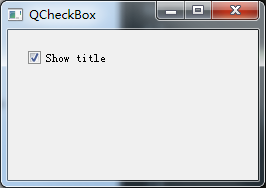
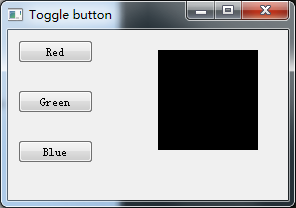
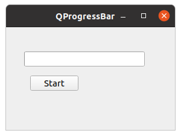
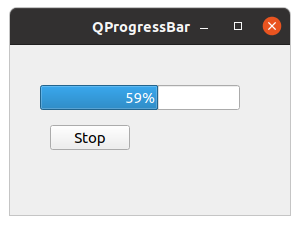
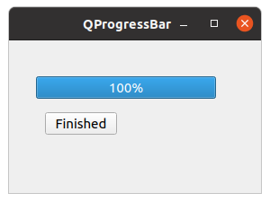
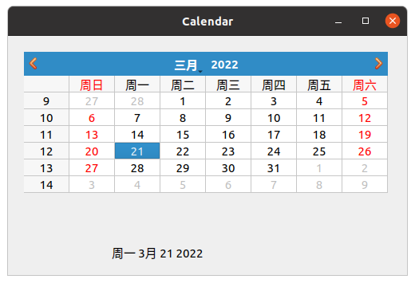

# PyQt5控件(I)

控件是构建应用程序的基本模块，PyQt5提供各种各样的控件，包括按钮、复选框、滑动条、列表框等。在这部分的教程中,我们将详细介绍几个常用的控件:QCheckBox,ToggleButton,QSlider,QProgressBar,QCalendarWidget。

> ## QCheckBox

QCheckBox复选框控件，它有两个状态:打开和关闭，他是一个带有文本标签（Label）的控件。复选框常用于表示程序中可以启用或禁用的功能。

```python
# -*- coding: utf-8 -*-

"""
PyQt5 tutorial 

In this example, we determine the event sender
object.

author: py40.com
last edited: 2017年3月
"""
import sys
from PyQt5.QtWidgets import QWidget, QCheckBox, QApplication
from PyQt5.QtCore import Qt


class Example(QWidget):
    
    def __init__(self):
        super().__init__()
        
        self.initUI()
        
        
    def initUI(self):      

        cb = QCheckBox('Show title', self)
        cb.move(20, 20)
        cb.toggle()
        cb.stateChanged.connect(self.changeTitle)
        
        self.setGeometry(300, 300, 250, 150)
        self.setWindowTitle('QCheckBox')
        self.show()
        
        
    def changeTitle(self, state):
      
        if state == Qt.Checked:
            self.setWindowTitle('QCheckBox')
        else:
            self.setWindowTitle('')
            
        
if __name__ == '__main__':
    
    app = QApplication(sys.argv)
    ex = Example()
    sys.exit(app.exec_())
```

在我们的示例中,我们将创建一个复选框,将切换窗口标题。

```python
cb = QCheckBox('Show title', self)
```

这是QCheckBox的构造行数

```pytho
cb.toggle()
```

我们有设置窗口标题,所以我们也必须检查复选框。默认情况下,没有设置窗口标题和也没有勾选复选框。

```python
cb.stateChanged.connect(self.changeTitle)
```

我们将自定义的changeTitle()方法连接到stateChanged信号。这个方法会切换窗体的标题。

```pytho
def changeTitle(self, state):
    
    if state == Qt.Checked:
        self.setWindowTitle('QCheckBox')
    else:
        self.setWindowTitle('')
```

复选框的状态经由state参数传入changeTitle()方法。在勾选复选框时设置窗体标题，取消勾选时就将标题设为空字符串。



> ## 开关按钮 Toggle button

ToggleButton是QPushButton的一种特殊模式。它是一个有两种状态的按钮：按下与未按下。通过点击在这两种状态间来回切换。这种功能在某些场景会很实用。

```python
# -*- coding: utf-8 -*-

"""
PyQt5 tutorial 

In this example, we create three toggle buttons.
They will control the background color of a 
QFrame.

author: py40.com
last edited: 2017年3月
"""
import sys
from PyQt5.QtWidgets import (QWidget, QPushButton, 
    QFrame, QApplication)
from PyQt5.QtGui import QColor


class Example(QWidget):
    
    def __init__(self):
        super().__init__()
        
        self.initUI()
        
        
    def initUI(self):      

        self.col = QColor(0, 0, 0)       

        redb = QPushButton('Red', self)
        redb.setCheckable(True)
        redb.move(10, 10)

        redb.clicked[bool].connect(self.setColor)

        greenb = QPushButton('Green', self)
        greenb.setCheckable(True)
        greenb.move(10, 60)

        greenb.clicked[bool].connect(self.setColor)

        blueb = QPushButton('Blue', self)
        blueb.setCheckable(True)
        blueb.move(10, 110)

        blueb.clicked[bool].connect(self.setColor)

        self.square = QFrame(self)
        self.square.setGeometry(150, 20, 100, 100)
        self.square.setStyleSheet("QWidget { background-color: %s }" %  
            self.col.name())
        
        self.setGeometry(300, 300, 280, 170)
        self.setWindowTitle('Toggle button')
        self.show()
        
        
    def setColor(self, pressed):
        
        source = self.sender()
        
        if pressed:
            val = 255
        else: val = 0
                        
        if source.text() == "Red":
            self.col.setRed(val)                
        elif source.text() == "Green":
            self.col.setGreen(val)             
        else:
            self.col.setBlue(val) 
            
        self.square.setStyleSheet("QFrame { background-color: %s }" %
            self.col.name())  
       
       
if __name__ == '__main__':
    
    app = QApplication(sys.argv)
    ex = Example()
    sys.exit(app.exec_())
```

代码中我们创建了三个ToggleButton与一个QWidget。我们将QWidget的背景色设为黑色。ToggleButton会切换颜色值中的红色、绿色与蓝色部分。QWidget的背景颜色依赖于按下的按钮。

```python
self.col = QColor(0, 0, 0)
```

这是初始黑颜色的值。

```python
redb = QPushButton('Red', self)
redb.setCheckable(True)
redb.move(10, 10)
```

我们创建一个QPushButton并通过其setCheckable()方法来得到一个ToggleButton。

```python
redb.clicked[bool].connect(self.setColor)
```

将clicked信号连接到用户自定义的方法。我们通过clicked信号操作一个布尔值。

```python
if source.text() == "Red":
    self.col.setRed(val)
```

我们得到了按下的按钮。

```python
if source.text() == "Red":
    self.col.setRed(val)
```

如果按下的是red按钮，我们要相应地更新颜色中的红包部分。

```python
self.square.setStyleSheet("QFrame { background-color: %s }" %
    self.col.name())   
self.square.setStyleSheet("QFrame { background-color: %s }" %
    self.col.name())  
```



> ## 滑动条 QSlider

QSlider是一个带有简单滑块的控件。滑块可以前后拖动。我们可以通过拖动选择一个特定的值。有时使用滑动条比直接输入数字或使用旋转框更加自然。

在下面的例子中，我们会显示一个滑动条与一个标签，标签用于显示图片，并通过滑动条控件图片的显示 。

注意这里图片只能用ico格式的，png格式图片会显示不了。

```python
# -*- coding: utf-8 -*-

"""
PyQt5 tutorial 

This example shows a QSlider widget.

author: py40.com
last edited: 2017年3月
"""
import sys
from PyQt5.QtWidgets import (QWidget, QSlider, 
    QLabel, QApplication)
from PyQt5.QtCore import Qt
from PyQt5.QtGui import QPixmap


class Example(QWidget):
    
    def __init__(self):
        super().__init__()
        
        self.initUI()
        
        
    def initUI(self):      

        sld = QSlider(Qt.Horizontal, self)
        sld.setFocusPolicy(Qt.NoFocus)
        sld.setGeometry(30, 40, 100, 30)
        sld.valueChanged[int].connect(self.changeValue)
        
        self.label = QLabel(self)
        self.label.setPixmap(QPixmap('audio.ico'))
        self.label.setGeometry(160, 40, 80, 30)
        
        self.setGeometry(300, 300, 280, 170)
        self.setWindowTitle('QSlider')
        self.show()
        
        
    def changeValue(self, value):

        if value == 0:
            self.label.setPixmap(QPixmap('audio.ico'))
        elif value > 0 and value <= 30:
            self.label.setPixmap(QPixmap('min.ico'))
        elif value > 30 and value < 80:
            self.label.setPixmap(QPixmap('med.ico'))
        else:
            self.label.setPixmap(QPixmap('max.ico'))
            

if __name__ == '__main__':

    app = QApplication(sys.argv)
    ex = Example()
    sys.exit(app.exec_())    
```

例子中我们模拟了一个音量控制。通过拖动滑块来改变标签上的图像。

```python
sld = QSlider(Qt.Horizontal, self)
```

创建一个水平滑块

```python
self.label = QLabel(self)
self.label.setPixmap(QPixmap('mute.png'))
```

创建了一个QLabel控件并为它设置了一个初始音量图像。

```python
sld.valueChanged[int].connect(self.changeValue)
```

我们将valueChanged信号连接到自定义的changeValue()方法。

```python
if value == 0:
    self.label.setPixmap(QPixmap('mute.png'))
...
```

我们根据滑动条的值来设置标签的图像。在上面的代码中，当滑动条的值为0时我们为标签设置audio.ico图像。


> ## 进度条QProgressBar

一个进度条是一个显示任务进展的控件。QProgressBar控件提供了一个水平或垂直PyQt5工具包的进度条。程序员可以设置进度条的最小和最大值。默认值是0到99。

```python
# -*- coding: utf-8 -*-

"""
PyQt5 tutorial 

This example shows a QProgressBar widget.


author: py40.com
last edited: 2017年3月
"""
import sys
from PyQt5.QtWidgets import (QWidget, QProgressBar,
                             QPushButton, QApplication)
from PyQt5.QtCore import QBasicTimer


class Example(QWidget):
    def __init__(self):
        super().__init__()

        self.initUI()

    def initUI(self):

        self.pbar = QProgressBar(self)
        self.pbar.setGeometry(30, 40, 200, 25)

        self.btn = QPushButton('Start', self)
        self.btn.move(40, 80)
        self.btn.clicked.connect(self.doAction)

        self.timer = QBasicTimer()
        self.step = 0

        self.setGeometry(300, 300, 280, 170)
        self.setWindowTitle('QProgressBar')
        self.show()

    def timerEvent(self, e):

        if self.step >= 100:
            self.timer.stop()
            self.btn.setText('Finished')
            return

        self.step = self.step + 1
        self.pbar.setValue(self.step)

    def doAction(self):

        if self.timer.isActive():
            self.timer.stop()
            self.btn.setText('Start')
        else:
            self.timer.start(100, self)
            self.btn.setText('Stop')


if __name__ == '__main__':
    app = QApplication(sys.argv)
    ex = Example()
    sys.exit(app.exec_())
```

这个例子显示一个水平的进度条和一个按钮，用户通过点击按钮开始和停止进度条

```python
self.pbar = QProgressBar(self)
```

QProgressBar的构造方法

```python
self.timer = QtCore.QBasicTimer()
```

我们使用定时器timer来激活QProgressBar

```python
self.timer.start(100, self)
```

我们调用start()方法启动一个计时器。这个方法有两个参数:超时和对象将接收的事件。

```python
def timerEvent(self, e):
  
    if self.step >= 100:
    
        self.timer.stop()
        self.btn.setText('Finished')
        return
        
    self.step = self.step + 1
    self.pbar.setValue(self.step)
```

每个QObject及其子类都有一个timerEvent()事件处理器。我们要重新实现这个事件处理器来响应定时器事件。

```python
def doAction(self):
  
    if self.timer.isActive():
        self.timer.stop()
        self.btn.setText('Start')
        
    else:
        self.timer.start(100, self)
        self.btn.setText('Stop')
```

我们在doAction()方法中启动/停止定时器。



启动后



完成



> ## 日历控件 QCalendarWidget

QCalendarWidget提供了一个基于月份的日历控件。它使用户以一种简单直观的方式来选择日期。

```python
# -*- coding: utf-8 -*-

"""
PyQt5 tutorial 

This example shows a QCalendarWidget widget.

author: py40.com
last edited: 2017年3月
"""
import sys
from PyQt5.QtWidgets import (QWidget, QCalendarWidget,
                             QLabel, QApplication)
from PyQt5.QtCore import QDate


class Example(QWidget):
    def __init__(self):
        super().__init__()

        self.initUI()

    def initUI(self):
        cal = QCalendarWidget(self)
        cal.setGridVisible(True)
        cal.move(20, 20)
        cal.clicked[QDate].connect(self.showDate)

        self.lbl = QLabel(self)
        date = cal.selectedDate()
        self.lbl.setText(date.toString())
        self.lbl.move(130, 260)

        self.setGeometry(300, 300, 350, 300)
        self.setWindowTitle('Calendar')
        self.show()

    def showDate(self, date):
        self.lbl.setText(date.toString())


if __name__ == '__main__':
    app = QApplication(sys.argv)
    ex = Example()
    sys.exit(app.exec_())
```

示例中创建了一个日历控件和一个标签控件。选择的日期会显示在标签控件中。

```python
cal = QCalendarWidget(self)
```

QCalendarWidget被创建

```python
cal.clicked[QDate].connect(self.showDate)
```

如果我们从部件选择一个日期,点击[QDate]发出信号。我们将这个信号连接到用户定义的showDate()方法。

```python
def showDate(self, date):     
    
    self.lbl.setText(date.toString())
```

我们检索所选日期通过调用selectedDate()方法。然后我们将date对象转换为字符串,并将其设置为小部件的标签。


