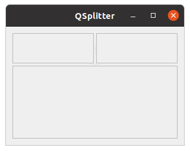
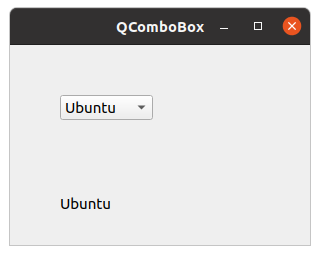

# PyQt5控件(II)

在这里我们将继续介绍PyQt5控件。我们将介绍QPixmap、QLineEdit QSplitter,QComboBox。

> ## QPixmap

QPixmap是用于处理图像的控件。是优化的显示图像在屏幕上。在我们的代码示例中,我们将使用QPixmap窗口显示一个图像。

```python
# -*- coding: utf-8 -*-

"""
PyQt5 tutorial 

In this example, we dispay an image
on the window.

author: py40.com
last edited: 2017年3月
"""
import sys
from PyQt5.QtWidgets import (QWidget, QHBoxLayout,
                             QLabel, QApplication)
from PyQt5.QtGui import QPixmap


class Example(QWidget):
    def __init__(self):
        super().__init__()

        self.initUI()

    def initUI(self):
        hbox = QHBoxLayout(self)
        pixmap = QPixmap("icon.png")

        lbl = QLabel(self)
        lbl.setPixmap(pixmap)

        hbox.addWidget(lbl)
        self.setLayout(hbox)

        self.move(300, 200)
        self.setWindowTitle('Red Rock')
        self.show()


if __name__ == '__main__':
    app = QApplication(sys.argv)
    ex = Example()
    sys.exit(app.exec_())
```

在窗口上显示一个图片

```python
pixmap = QPixmap("icon.png")
```

创建一个QPixmap 对象，它将传入的文件名作为参数。

```python
lbl = QLabel(self)
lbl.setPixmap(pixmap)
```

我们将这个pixmap放到QLabel控件中。

> ## 文本框 QLineEdit

QLineEdit是用于输入或编辑单行文本的控件。它还有撤销重做、剪切复制和拖拽功能。

```python
# -*- coding: utf-8 -*-

"""
PyQt5 tutorial 

This example shows text which
is entered in a QLineEdit
in a QLabel widget.

author: py40.com
last edited: 2017年3月
"""
import sys
from PyQt5.QtWidgets import (QWidget, QLabel,
                             QLineEdit, QApplication)


class Example(QWidget):
    def __init__(self):
        super().__init__()

        self.initUI()

    def initUI(self):
        self.lbl = QLabel(self)
        qle = QLineEdit(self)

        qle.move(60, 100)
        self.lbl.move(60, 40)

        qle.textChanged[str].connect(self.onChanged)

        self.setGeometry(300, 300, 280, 170)
        self.setWindowTitle('QLineEdit')
        self.show()

    def onChanged(self, text):
        self.lbl.setText(text)
        self.lbl.adjustSize()


if __name__ == '__main__':
    app = QApplication(sys.argv)
    ex = Example()
    sys.exit(app.exec_())
```

示例中展示了一个QLineEdit与一个QLabel。我们在QLineEdit中输入的文字会实时显示在QLabel控件中。

```python
qle = QLineEdit(self)
```

创建QLineEdit

```python
qle.textChanged[str].connect(self.onChanged)
```

文本框的内容发生改变的时候，会调用onChanged方法

```python
def onChanged(self, text):
    
    self.lbl.setText(text)
    self.lbl.adjustSize() 
```

在onChanged()方法中我们将QLabel控件的文本设置为输入的内容。通过调用adjustSize()方法将QLabel控件的尺寸调整为文本的长度。

> ## QSplitter

通过QSplitter，用户可以拖动子控件边界来调整子控件的尺寸。在下面的示例中，我们展示了三个由两个QSplitter组织的QFrame控件。

```python
# -*- coding: utf-8 -*-

"""
PyQt5 tutorial 

This example shows
how to use QSplitter widget.

author: py40.com
last edited: 2017年3月
"""
import sys
from PyQt5.QtWidgets import (QWidget, QHBoxLayout, QFrame,
                             QSplitter, QStyleFactory, QApplication)
from PyQt5.QtCore import Qt


class Example(QWidget):
    def __init__(self):
        super().__init__()

        self.initUI()

    def initUI(self):
        hbox = QHBoxLayout(self)

        topleft = QFrame(self)
        topleft.setFrameShape(QFrame.StyledPanel)

        topright = QFrame(self)
        topright.setFrameShape(QFrame.StyledPanel)

        bottom = QFrame(self)
        bottom.setFrameShape(QFrame.StyledPanel)

        splitter1 = QSplitter(Qt.Horizontal)
        splitter1.addWidget(topleft)
        splitter1.addWidget(topright)

        splitter2 = QSplitter(Qt.Vertical)
        splitter2.addWidget(splitter1)
        splitter2.addWidget(bottom)

        hbox.addWidget(splitter2)
        self.setLayout(hbox)

        self.setGeometry(300, 300, 300, 200)
        self.setWindowTitle('QSplitter')
        self.show()


if __name__ == '__main__':
    app = QApplication(sys.argv)
    ex = Example()
    sys.exit(app.exec_())
```

示例中我们创建了三个QFrame与两个QSplitter。注意在某些主题中这些QSplitter可能会不可见。

```python
topleft = QFrame(self)
topleft.setFrameShape(QFrame.StyledPanel)
```

我们使用一个风格框架为了看到QFrame小部件之间的界限。

```python
splitter1 = QSplitter(Qt.Horizontal)
splitter1.addWidget(topleft)
splitter1.addWidget(topright)
```

我们创建一个QSplitter小部件和添加两个帧。

```python
splitter2 = QSplitter(Qt.Vertical)
splitter2.addWidget(splitter1)
```

我们也可以将QSplitter添加到另一个QSplitter控件中。



> ## 下拉列表 QComboBox

QComboBox是允许用户从下拉列表中进行选择的控件。

```python
# -*- coding: utf-8 -*-

"""
PyQt5 tutorial 

This example shows how to use
a QComboBox widget.

author: py40.com
last edited: 2017年3月
"""
import sys
from PyQt5.QtWidgets import (QWidget, QLabel,
                             QComboBox, QApplication)


class Example(QWidget):
    def __init__(self):
        super().__init__()

        self.initUI()

    def initUI(self):
        self.lbl = QLabel("Ubuntu", self)

        combo = QComboBox(self)
        combo.addItem("Ubuntu")
        combo.addItem("Mandriva")
        combo.addItem("Fedora")
        combo.addItem("Arch")
        combo.addItem("Gentoo")

        combo.move(50, 50)
        self.lbl.move(50, 150)

        combo.activated[str].connect(self.onActivated)

        self.setGeometry(300, 300, 300, 200)
        self.setWindowTitle('QComboBox')
        self.show()

    def onActivated(self, text):
        self.lbl.setText(text)
        self.lbl.adjustSize()


if __name__ == '__main__':
    app = QApplication(sys.argv)
    ex = Example()
    sys.exit(app.exec_())
```

示例中展示了一个QComboBox与一个QLabel，QComboBox控件中有5个选项(Linux系统的几个发行版名称)。QLabel控件会显示QComboBox中选中的某个选项。

```python
combo = QComboBox(self)
combo.addItem("Ubuntu")
combo.addItem("Mandriva")
combo.addItem("Fedora")
combo.addItem("Arch")
combo.addItem("Gentoo")
```

创建了一个有五个选项的QComboBox

```python
combo.activated[str].connect(self.onActivated) 
```

当选中某个条目时会调用onActivated()方法。

```python
def onActivated(self, text):
  
    self.lbl.setText(text)
    self.lbl.adjustSize() 
```

在方法中我们将QLabel控件的内容设置为选中的条目，然后调整它的尺寸。

