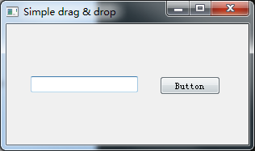

# PyQt 拖拽

在这部分PyQt5教程中,我们将讨论拖拽相关操作。

在计算机图形用户界面中,拖放的操作(或支持的作用)点击虚拟对象和拖动到另一个位置或到另一个虚拟对象。一般来说,它可以用于调用多种行动,或创建各种类型的两个抽象对象之间的关联。
拖放是图形用户界面的一部分。拖拽操作让用户直观地做复杂的事情。
通常,我们可以拖放两件事:数据或一些图形对象。如果我们把一个图像从一个应用程序到另一个地方,我们拖拽二进制数据。如果我们把一个标签在Firefox中并将其移动到另一个地方,我们拖拽一个图形组件。

> ## 简单拖放

在第一个示例中,我们有一个QLineEdit QPushButton。我们拖着纯文本的行编辑窗口小部件,然后放到按钮部件。按钮的标签会改变。

```python
# -*- coding: utf-8 -*-

"""
PyQt5 tutorial 

This is a simple drag and
drop example.

author: py40.com
last edited: 2017年3月
"""
import sys
from PyQt5.QtWidgets import (QPushButton, QWidget,
                             QLineEdit, QApplication)


class Button(QPushButton):
    def __init__(self, title, parent):
        super().__init__(title, parent)

        self.setAcceptDrops(True)

    def dragEnterEvent(self, e):

        if e.mimeData().hasFormat('text/plain'):
            e.accept()
        else:
            e.ignore()

    def dropEvent(self, e):

        self.setText(e.mimeData().text())


class Example(QWidget):
    def __init__(self):
        super().__init__()

        self.initUI()

    def initUI(self):
        edit = QLineEdit('', self)
        edit.setDragEnabled(True)
        edit.move(30, 65)

        button = Button("Button", self)
        button.move(190, 65)

        self.setWindowTitle('Simple drag & drop')
        self.setGeometry(300, 300, 300, 150)


if __name__ == '__main__':
    app = QApplication(sys.argv)
    ex = Example()
    ex.show()
    app.exec_()  
```

这个列子演示了一个简单的拖拽操作

```python
class Button(QPushButton):
  
    def __init__(self, title, parent):
        super().__init__(title, parent)
        
        self.setAcceptDrops(True)
```

我们需要重新实现某些方法才能使QPushButton接受拖放操作。因此我们创建了继承自QPushButton的Button类。

```python
self.setAcceptDrops(True)
```

使该控件接受drop(放下)事件。

```python
def dragEnterEvent(self, e):
    
    if e.mimeData().hasFormat('text/plain'):
        e.accept()
    else:
        e.ignore() 
```

首先我们重新实现了dragEnterEvent()方法，并设置可接受的数据类型(在这里是普通文本)。

```python
def dropEvent(self, e):

    self.setText(e.mimeData().text()) 
```

通过重新实现dropEvent()方法，我们定义了在drop事件发生时的行为。这里我们改变了按钮的文字。

```python
edit = QLineEdit('', self)
edit.setDragEnabled(True)
```

QLineEdit内置了对drag(拖动)操作的支持。我们只需要调用setDragEnabled()方法就可以了。



> ## 拖放一个按钮

在下面的示例中我们将演示如何对一个按钮控件进行拖放。

```python
# -*- coding: utf-8 -*-

"""
PyQt5 tutorial 

This is a simple drag and
drop example.

author: py40.com
last edited: 2017年3月
"""
import sys
from PyQt5.QtWidgets import QPushButton, QWidget, QApplication
from PyQt5.QtCore import Qt, QMimeData
from PyQt5.QtGui import QDrag


class Button(QPushButton):
    def __init__(self, title, parent):
        super().__init__(title, parent)

    def mouseMoveEvent(self, e):

        if e.buttons() != Qt.RightButton:
            return

        mimeData = QMimeData()

        drag = QDrag(self)
        drag.setMimeData(mimeData)
        drag.setHotSpot(e.pos() - self.rect().topLeft())

        dropAction = drag.exec_(Qt.MoveAction)

    def mousePressEvent(self, e):

        QPushButton.mousePressEvent(self, e)

        if e.button() == Qt.LeftButton:
            print('press')


class Example(QWidget):
    def __init__(self):
        super().__init__()

        self.initUI()

    def initUI(self):
        self.setAcceptDrops(True)

        self.button = Button('Button', self)
        self.button.move(100, 65)

        self.setWindowTitle('Click or Move')
        self.setGeometry(300, 300, 280, 150)

    def dragEnterEvent(self, e):
        e.accept()

    def dropEvent(self, e):
        position = e.pos()
        self.button.move(position)

        e.setDropAction(Qt.MoveAction)
        e.accept()


if __name__ == '__main__':
    app = QApplication(sys.argv)
    ex = Example()
    ex.show()
    app.exec_()  
```

在这个例子中，在窗口显示一个QPushButton 。如果用鼠标左键点击这个按钮会在控制台中输出’press’消息。鼠标右击进行拖动。

```python
class Button(QPushButton):
  
    def __init__(self, title, parent):
        super().__init__(title, parent)
```

我们从QPushButton派生了一个Button类，并重新实现了mouseMoveEvent()与mousePressEvent()方法。mouseMoveEvent()方法是拖放操作产生的地方。

```python
if e.buttons() != Qt.RightButton:
    return
```

在这里我们设置只在鼠标右击时才执行拖放操作。鼠标左击用于按钮的点击事件。

```python
mimeData = QMimeData()

drag = QDrag(self)
drag.setMimeData(mimeData)
drag.setHotSpot(e.pos() - self.rect().topLeft())
```

QDrag提供了对基于MIME的拖放的数据传输的支持。

```python
dropAction = drag.exec_(Qt.MoveAction)
```

Drag对象的exec_()方法用于启动拖放操作。

```python
def mousePressEvent(self, e):

    QPushButton.mousePressEvent(self, e)

    if e.button() == Qt.LeftButton:
        print('press')
```

鼠标左击按钮时我们会在控制台打印‘press’。注意我们也调用了父按钮的mousePressEvent()方法。否则会看不到按钮的按下效果。

```python
position = e.pos()
self.button.move(position)
```

释放右键后调用dropEvent()方法中，即找出鼠标指针的当前位置，并将按钮移动过去。

```python
e.setDropAction(Qt.MoveAction)
e.accept()
```

我们可以对指定的类型放弃行动。在我们的例子中它是一个移动动作。